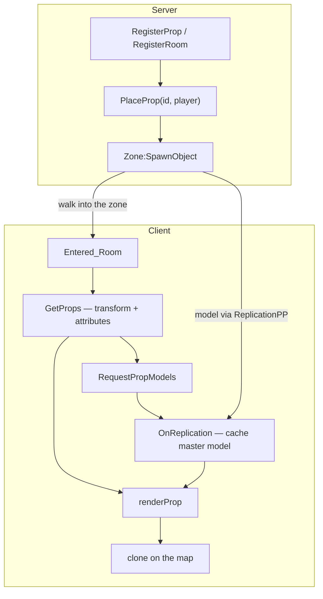
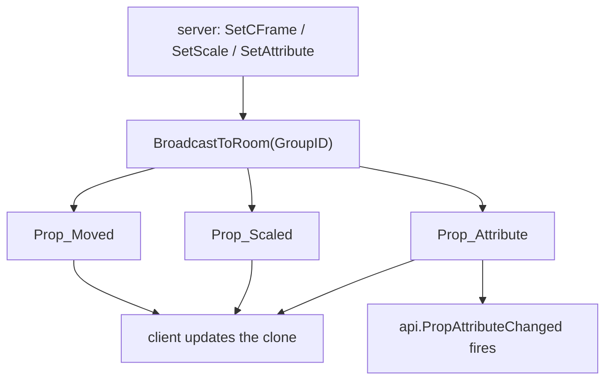
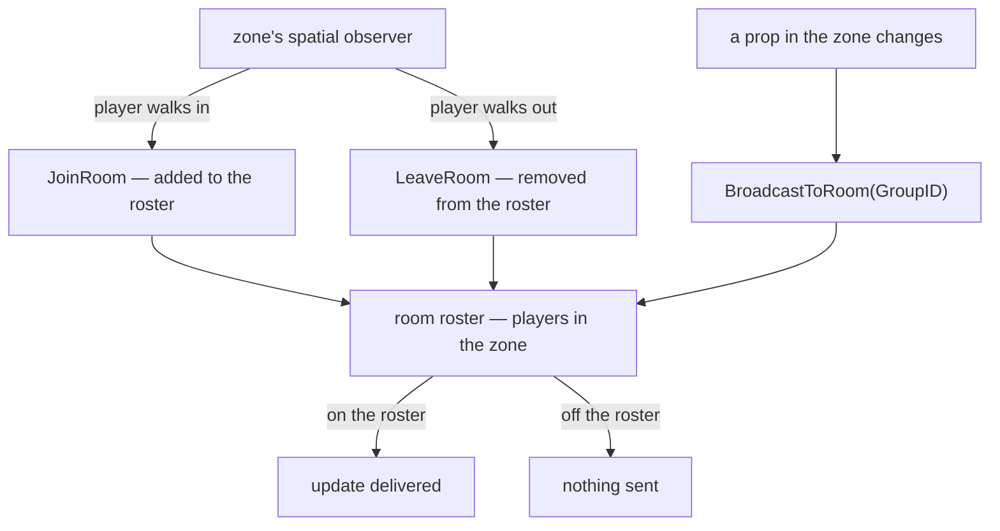
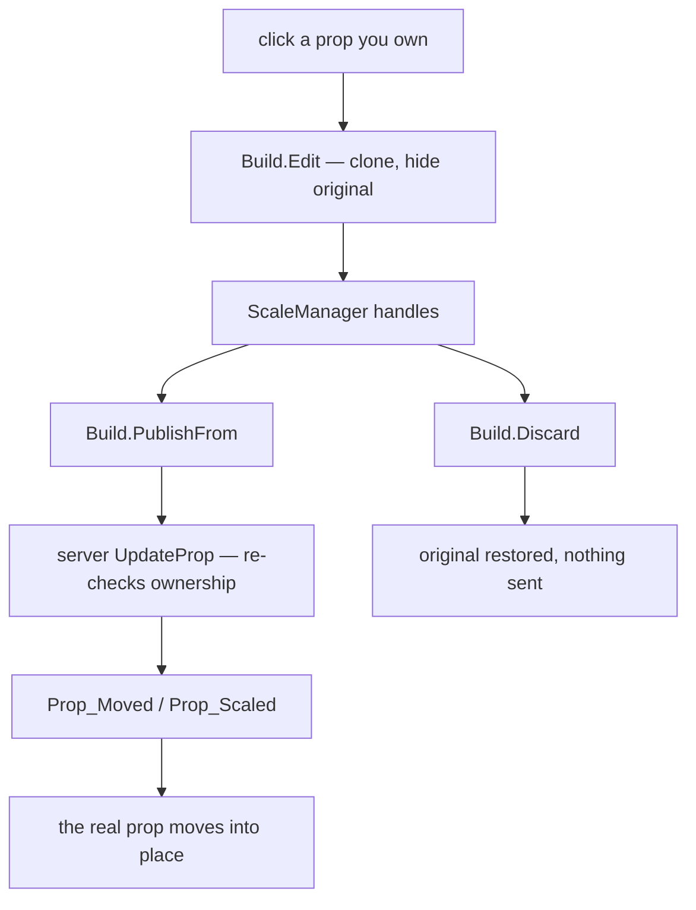
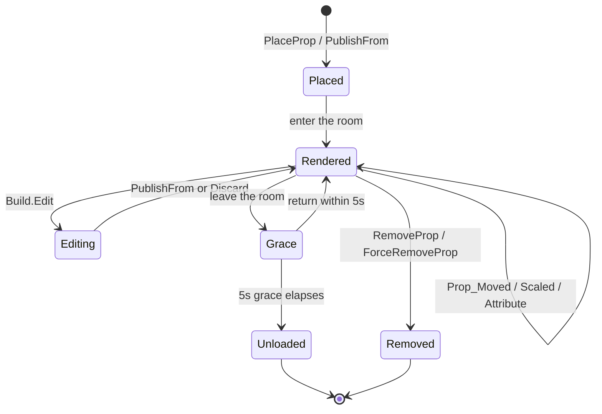
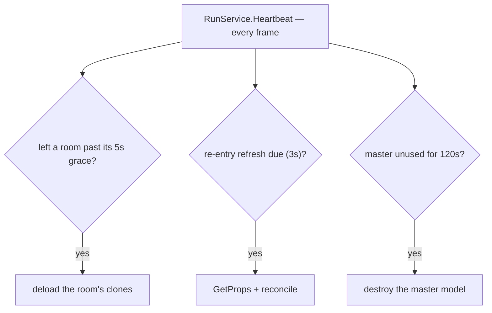

# How Props Flow

Props are **owned by the server** and **rendered by the client**. The server never
sends a player props for a room they aren't standing in, and the client never
edits the real prop directly — it works on a clone and asks the server to commit.

These diagrams trace that path.

## Server → client: placing & rendering

A prop is registered and placed on the server. The player walks into its zone, the
client pulls the prop data, requests the model, and renders a clone.

- **`GetProps`** carries the transform, scale limits, and **all the prop's
  attributes** — but only for rooms you're in.
- The **model** is replicated once via ReplicationPP and kept as a single hidden
  *master*; every rendered prop is a clone of it.
- `renderProp` waits for both the data and the master, then puts a clone on the map.

## Live updates

While you're in the room, the server broadcasts every change and the client
applies it to the matching clone.

### How the zone scopes it

That broadcast is **room-scoped** — it only reaches players standing in the zone.
Each [Zone](/api/zone.md) runs a spatial observer that keeps the room roster:
walking in adds you, walking out drops you. `BroadcastToRoom` then delivers only to
whoever is currently on it.

## Editing: client → server → back

Editing clones the rendered prop and hides the original. Nothing changes
server-side until you publish; the real prop only moves once the server confirms
and broadcasts the update back.

`PublishFrom` returns `false` if the server dropped the request (cooldown, or a
check vetoed it) — and you stay in edit mode instead of losing your work.

## The prop lifecycle

The **Grace** and **Unloaded** states above are driven by the cleanup scheduler.

## The cleanup scheduler

The client runs a single `RunService.Heartbeat` loop for all timed cleanup —
nothing uses `task.delay`, so every timer can be cancelled the moment you change
your mind (like walking back into a zone).

Three jobs run off it:

- **Grace deload — 5s.** Leaving a zone doesn't unload anything right away. A 5s
  timer starts; walk back in and it's cancelled (the clones stay), otherwise the
  room's clones are destroyed. If you leave mid-load, the timer doesn't even start
  until the load finishes.
- **Re-entry refresh — 3s.** When you walk back in within grace, a 3s timer
  schedules a `GetProps` re-fetch. The delay clears the server's request debounce,
  and the reconcile applies anything that moved, scaled, was added, or removed
  while you were gone.
- **Master eviction — 120s.** A replicated **master** model nobody has cloned from
  for ~2 minutes is destroyed to free memory. The **clones already on the map stay**
  — only the hidden source is dumped, and it's re-requested automatically if a prop
  needs it again.

See [PropPlacer](/api/propplacer.md) for the API behind each box.
