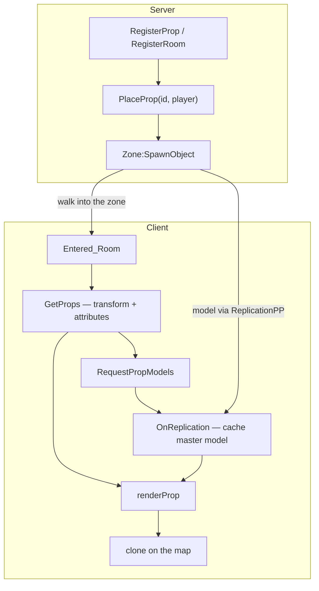
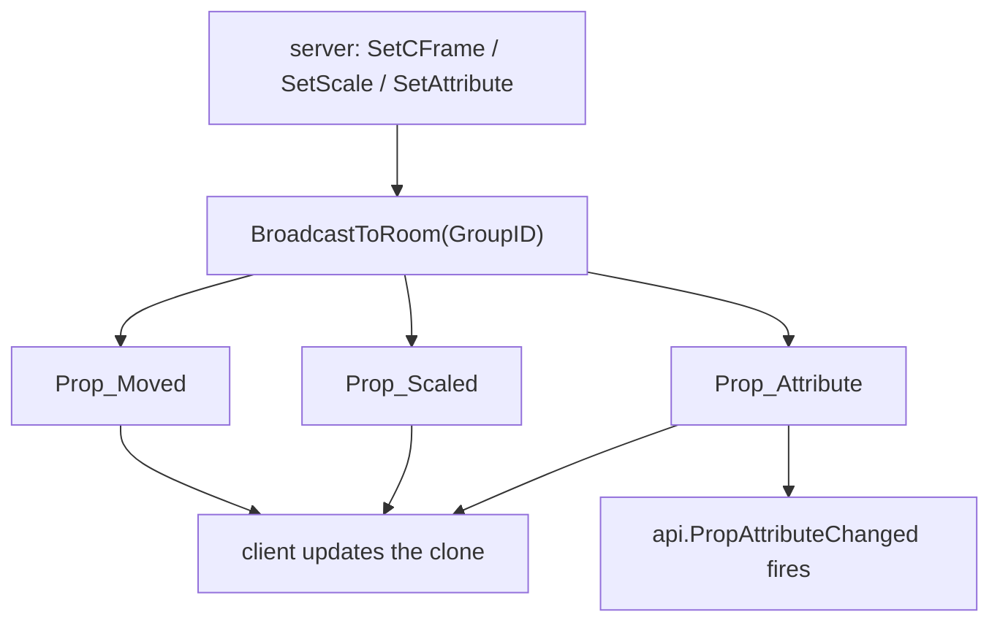
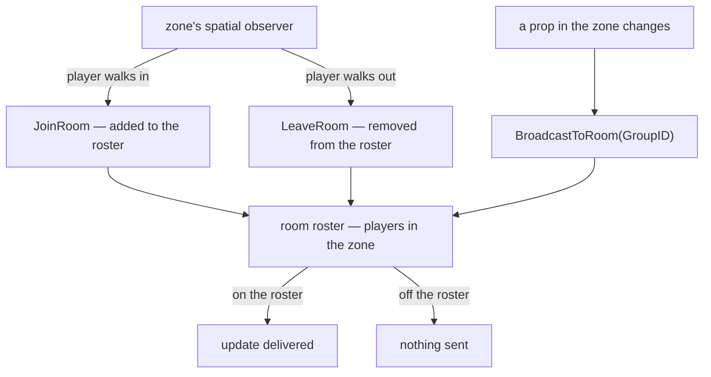
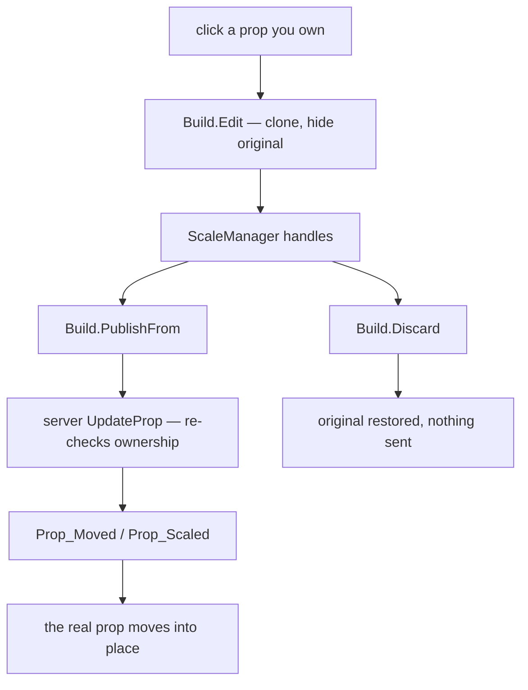
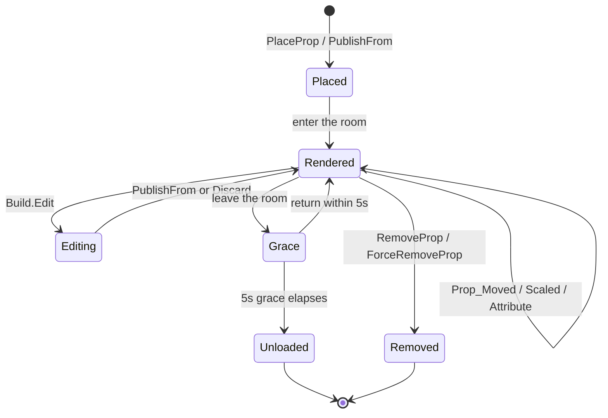

# How Props Flow

Props are **owned by the server** and **rendered by the client**. The server never
sends a player props for a room they aren't standing in, and the client never
edits the real prop directly — it works on a clone and asks the server to commit.

These diagrams trace that path.

## Server → client: placing & rendering

A prop is registered and placed on the server. The player walks into its zone, the
client pulls the prop data, requests the model, and renders a clone.

- **`GetProps`** carries the transform, scale limits, and **all the prop's
  attributes** — but only for rooms you're in.
- The **model** is replicated once via ReplicationPP and kept as a single hidden
  *master*; every rendered prop is a clone of it.
- `renderProp` waits for both the data and the master, then puts a clone on the map.

## Live updates

While you're in the room, the server broadcasts every change and the client
applies it to the matching clone.

### How the zone scopes it

That broadcast is **room-scoped** — it only reaches players standing in the zone.
Each [Zone](/api/zone.md) runs a spatial observer that keeps the room roster:
walking in adds you, walking out drops you. `BroadcastToRoom` then delivers only to
whoever is currently on it.

## Editing: client → server → back

Editing clones the rendered prop and hides the original. Nothing changes
server-side until you publish; the real prop only moves once the server confirms
and broadcasts the update back.

`PublishFrom` returns `false` if the server dropped the request (cooldown, or a
check vetoed it) — and you stay in edit mode instead of losing your work.

## The prop lifecycle

- **Grace** — leaving a zone doesn't deload immediately. The clone is kept for 5
  seconds; come back and it stays (and re-syncs anything missed), otherwise it's
  destroyed.
- **Eviction** — separately, a master model nobody has cloned from for a while is
  dumped to free memory. The clones on the map stay; the model is re-requested if
  it's ever needed again.

See [PropPlacer](/api/propplacer.md) for the API behind each box.
